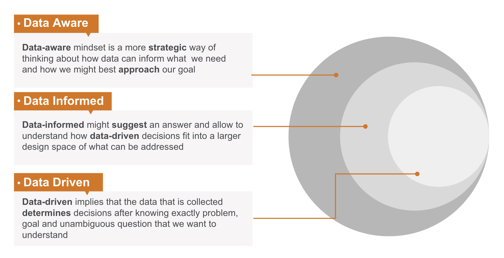

<aside>

💡 This topic discusses how we think about data between data aware, data informed, and data driven - as a data approach for various jobs or in daily life. It is a part of sharing session which I presented in Fossil Vietnam on August 2022.

</aside>

Every day business will make important decisions and how to make them most confident in their decisions. So those decisions are all based on data. And the most important thing is that people have to believe in the data they see, only then can they optimize the benefits that data brings to the user and at the same time help the business spend less time in double checking. data and complain data.

DIKW hierarchy 

 

Regarding the value that data brings, starting with processing and exploiting important information from there we begin to have information and insights. Based on that information and insight, the business will have certain knowledge, from which to build up wisdom and understanding of what is going on in business. So data is not only the foundation of insights but also the strength of a business.

Therefore, I will introduce three ways to think about data - data aware, data inform and driven. This content is inspired from “*Designing with data: Improving the user experience with A/B testing” -* Rochelle King, Elizabeth F. Churchill & Caitlin Tan

 

# Data Driven

Data-driven indicates that the information gathered drives decisions. In certain cases, this is the best course of action. The  questions can sometimes be definitely answered by gathering data through experimental. The results of their data collecting clearly map to a clear optimal option.

<section>
    
    

    

    A data-driven process is imagine as on a railway station about to board a train. The train is already on the right track (it is dependable, and its destination is definite, established, and repeatable).
    

    We are certain that we are on the right train and right direction. 
    

      <ol role="list">
        	<li>Before that, we already done all of the works → identifying your problem, goals</li>
          <li>Know where you want to go → data can now answer precise tactical questions</li>
      </ol>
    

</section>

<aside>

#### 📚 Data is a *source of truth* - This is **an application** of data

</aside>

 

# Data Inform

In other cases, the facts may point to a less-than-clear solution. This is the term data-informed decision-making, in which a team **uses data as merely one input in their decision-making process**.
The outcome may not be a clear option, but it may result in the establishment of another iteration or research. More research, other types of data, and/or an informed creative leap may be required at this point. 

Adopting a data-informed viewpoint implies that we may not be guided in our understanding. Instead, data informs how we think about the problem and the problem space, as well as answers certain questions along the road, but we are informed by data because we are still iterating on what the problem space is within the goals that we have. This is a more creative, expansive, and crucially iterative environment. We can't be data-driven until we consider problem space in a data-informed way at some point.

A train station is a good metaphor for being data informed: there are multiple trains that go to different places, and we are aware that there are alternatives for determining which train to board. There is less certainty and more room for exploration, with numerous potential destinations at the end.

<aside>

#### 📎 This is a **discipline and a practice** around data

</aside>

 

# Data Driven

Data-aware to emphasize the fact that decisions must be made not only from data but also from data collection practices — that how a system is instrumented, what data types are captured, and how they are combined, is a  problem in and of itself.

And the important things that create systems so that the right data types are collected to address the right questions

If we are aware that there are several types of issue solving to address our larger goals, we are also aware of the various types of data that lead to solutions for various issues.

We talked more about how to go by train but think more generally, trains are simply one way to go and there are various transportation options. When we’re data aware, we're considering a wide range of challenges with a wide range of data. We're engaging with a variety of data and methodologies.

<aside>

#### 📖 This is a **philosophy** about data

</aside>

 

# Summary

 

<table style="font-size: 0.8em">
   <thead>
      <tr>
         <th>Term</th>
         <th>Data Driven</th>
         <th>Data Inform</th>
         <th>Data Aware</th>
      </tr>
   </thead>
   <tbody>
      <tr>
         <td>WHAT</td>
         <td>Data is collected to determine decisions</td>
         <td>Data as a substance that determines decision making</td>
         <td>There are several forms of data that can lead to solutions for various issues</td>
      </tr>
      <tr>
         <td>WHY</td>
         <td>Answer the specific question after knowing exactly problem, goal and unambiguous question that we want to understand</td>
         <td>We can't be data-driven until iterating on what the problem space is within the goals that we have</td>
         <td>A strategic way of thinking about how data-inform what we need and how we might best approach our goal</td>
      </tr>
   </tbody>
</table>

 

# Bonus | Data in the future - A/B Testing

A/B testing (also known as split testing) is the practice presenting a sampling of users with two versions of a screen or in-app experience and tracking user interactions with each version to determine if one more positively influences user behavior or engagement.

Source: [Everything you need to know about mobile app A/B testing](https://www.appsflyer.com/blog/measurement-analytics/mobile-ab-testing/)

 

*Source: King, R., Churchill, E. F., & Tan, C. (2017). Designing with data: Improving the user experience with A/B testing. " O'Reilly Media, Inc."*

Go through how to express ideas and goals as well-formed hypotheses that encapsulate the "why" and "what" of the test and what we eventually aim to learn and data should be used throughout and at each stage of this procedure

- **Goal**: Defining Goal with data and planning **experiment**(s) to address goal(s) by identifying **problem** and defining **hypotheses**.
- **Problem/Opportunity Areas:** Identifying the Problem that we are attempting to solve. We may conduct a series of experiments to investigate a problem/opportunity area. Each **experiment** can produce new data that can be used to inform the aim, and ***an experiment might have several hypotheses***.
- **Hypothesis**: Building hypotheses serves as a **north star** for staying focused and directing toward significant findings. **Each hypothesis** might contain many **test cells** or **expressions**.
- **Test**: conducted by launching the experience to a subset of your users.
- **Result**: by gathering user feedback on **test** and analyzing the findings, we'll take these findings and decide what to do next.

<aside>

#### 📚 One way to construct a strong hypothesis is: For [ *user group(s)* ], if [ *change* ] then [ *effect* ] because [ *rationale* ], which will impact [ *measure* ].

</aside>

It is corresponding to three phases: Definition, Execution, and Analysis

 

# Reference

1. King, R., Churchill, E. F., & Tan, C. (2017). Designing with data: Improving the user experience with A/B testing. " O'Reilly Media, Inc."
2. Everything you need to know about mobile app A/B testing,[https://www.appsflyer.com/blog/measurement-analytics/mobile-ab-testing/](https://www.appsflyer.com/blog/measurement-analytics/mobile-ab-testing)
